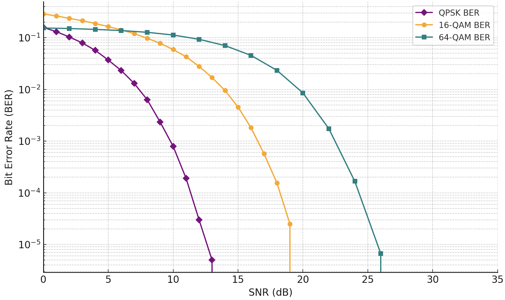

# QAM_BER_Analysis

## 📖 프로젝트 소개
`QAM_BER_Analysis`는 디지털 통신에서 사용되는 변조 방식(QPSK, 16-QAM, 64-QAM)에 대해 신호 대 잡음비(SNR)에 따른 비트 오류율(BER)을 시뮬레이션하여 분석하는 프로젝트입니다.  
본 프로젝트는 변조 방식의 성능을 비교하고, 노이즈 환경에서의 데이터 전송 신뢰도를 평가하기 위해 설계되었습니다.

---

## 🎯 실험 목표
1. **변조 방식 성능 비교**  
   - QPSK, 16-QAM, 64-QAM 변조 방식의 SNR 변화에 따른 BER 성능을 비교합니다.
2. **잡음 환경에서의 신뢰도 평가**  
   - 노이즈가 심한 환경에서 각 변조 방식이 데이터 전송에서 얼마나 신뢰도를 유지하는지 평가합니다.
3. **통신 설계 최적화 기초**  
   - 각 변조 방식의 특징과 한계를 이해하여 통신 시스템 설계 시 적합한 변조 방식을 선택하는 데 도움을 줍니다.

---

## 📊 주요 기능
- **변조 방식 구현**: QPSK, 16-QAM, 64-QAM 심볼 생성 및 평균 전력을 1로 정규화.
- **SNR 대 BER 시뮬레이션**: 다양한 SNR 값에 따른 BER 계산.
- **결과 시각화**: 각 변조 방식에 대해 SNR과 BER 관계를 그래프로 표시.

---

## 🔬 실험 조건
1. **심볼 데이터**  
   - QPSK: 심볼당 2비트 데이터 생성.  
   - 16-QAM: 심볼당 4비트 데이터 생성.  
   - 64-QAM: 심볼당 6비트 데이터 생성.
2. **신호 대 잡음비(SNR)**  
   - SNR 범위: 0 dB ~ 35 dB.  
   - 각 SNR 값에서 시뮬레이션 반복.
3. **노이즈 모델**  
   - 가우시안 분포를 따르는 복소 노이즈 추가.
4. **수신 신호 분석**  
   - 최소 거리 기준 디모듈레이션 방식 사용.

---

## 📈 실행 결과
- 아래는 QPSK, 16-QAM, 64-QAM 변조 방식의 SNR 대비 BER 그래프입니다.

- 그래프 해석:
  - **QPSK**: 낮은 SNR에서도 상대적으로 높은 신뢰도를 보입니다.
  - **16-QAM**: QPSK보다 높은 데이터 전송률을 가지지만, 더 높은 SNR을 요구합니다.
  - **64-QAM**: 가장 높은 데이터 전송률을 가지지만, 노이즈에 가장 민감합니다.

---

## 📂 파일 구성
- `QAM_BER_Analysis.py`: BER 계산 및 시뮬레이션 코드.
- `실행결과.png`: SNR 대비 BER 그래프 이미지.

---

## 🛠️ 사용 기술 스택
- **Python**: 데이터 처리 및 시뮬레이션.
- **NumPy**: 수학적 계산 및 데이터 생성.
- **Matplotlib**: 그래프 시각화.
